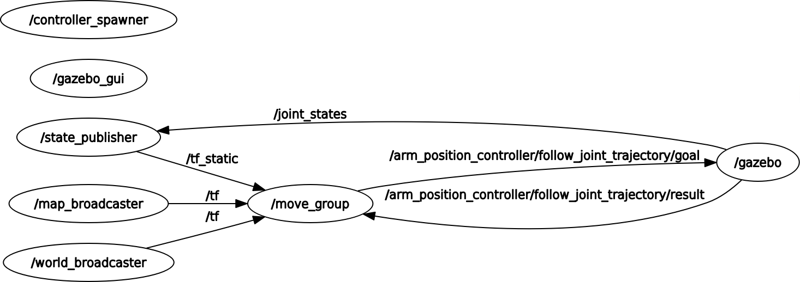

# MoveitArm-Example

Example of fixing the auto generated code given by moveit setup assistant (ROS Melodic) to work with Gazebo simulator and the real robot.

The chosen arm was the [Edo Comau](https://github.com/dhiegomaga/eDO_description)

### Test Gazebo simulation using MoveIt

```bash
roslaunch edo_moveit_config gazebo.launch
```

```bash
roslaunch edo_moveit_config moveit_planning_execution.launch
```

## Modifications

The auto generated files do not work, therefore this repository's commits describe how to fix the files and hopefully get it working.

I will _probably_ add an example of how to create a controller for the real arm as well.

## Implementing on Real Robot

First thing to consider when going from simulated robot to the real robot is the current graph structure:



What needs to be implemented is a node, that talks to the robot's motors, and provides the `/action_position_controller/follow_joint_trajectory` action server interfaces, and also publishes the current `joint_states`.

`/action_position_controller/follow_joint_trajectory` is the interface through which joint position commands are sent by the controller to the robot.

The node **state_publisher** uses the previously loaded `robot_description` param, as well as the topic `/joint_states` to output the current robot representation. It's not shown on this visualization, but the node **move_group** also subscribes to `/joint_states` to calculate the joint trajectories and planing of the robot.

## Issues Encountered

### Robot Collapsing

One issue I encountered was that the arm was **collapsing to the center of the map** as soon as I tried controlling it using MoveIt. I also got the error from the MoveIt package:

```bash
Controller failed with error code GOAL_TOLERANCE_VIOLATED
```

But this error is not caused by MoveIt, since I was also able to reproduce the problem without MoveIt, just using an outside controller.

For that I tried controlling it using the graphical interface for control, [rqt_joint_trajectory_controller](http://wiki.ros.org/rqt_joint_trajectory_controller), and the collapse continued to occur. It turned out that I needed to change the PID control values and the inertia/mass of each link.

[This](https://answers.gazebosim.org//question/4102/my-robot-blows-up-when-i-launch-the-controllers-update-2/) hinted me to this solution.

### Position Control instead of Effort Control

I tried changing from `effort_controllers/JointTrajectoryController` to `position_controllers/JointTrajectoryController` on the _robotic_arm_control.yaml_, so that the arm could be controlled using joint position angles instead of effort. However, doing so led to the following error:

```bash
Could not find joint 'joint_1' in 'hardware_interface::PositionJointInterface'
```

To fix this I needed to install the joint interfaces of ROS:

```bash
sudo apt install ros-melodic-joint-*
```

and also modify the URDF of the robot so the transmission is of the type `<hardwareInterface>hardware_interface/PositionJointInterface</hardwareInterface>` instead of `<hardwareInterface>hardware_interface/EffortJointInterface</hardwareInterface>`.

[This](https://answers.ros.org/question/285977/could-not-find-resource-in-hardware_interfaceeffortjointinterface/) hinted me to this solution.

### Arm Getting Stuck During Movement

Sometimes, while performing a more complicated movement, the Arm would get stuck and not move anymore, becoming unable to find a solution. I kept the constrains on time to solution and accuracy of solution pretty loose to avoid having issues of this nature. Yet I kept getting this problem and needing to restart the software.

The solution was to add joint angle limits to the Inverse Kinematics parameters, equal to (or more constraining than) the ones present on the URDF file. This was added to the _joint_limits.yaml_ file, for each joint:

```yaml
joint_limits:
...
  joint_3:
    ...
    has_position_limits: true
    min_position: -3.14
    max_position: 3.14
...
```

## Credits

Largely inspired by [this repository](https://github.com/kkumpa/ros-robotic-arm). However, MoveIt IK did not work with it, and I hypothesize it is because the arm in question does not possess 6 DoF (only 4). Hence the IK solver was not supposed to find a solution anyway.
